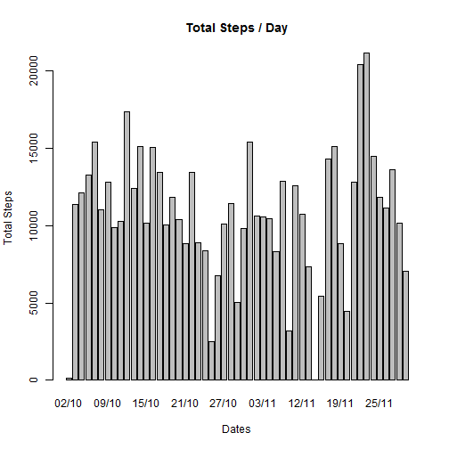
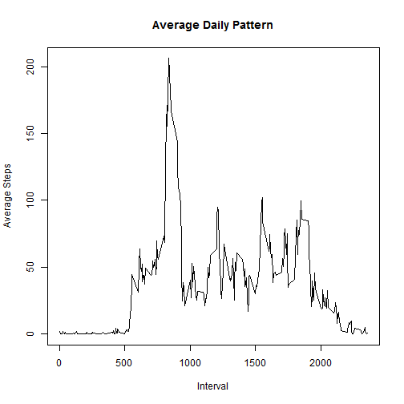
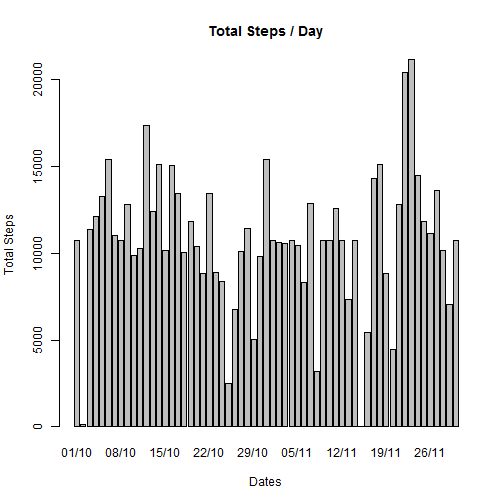
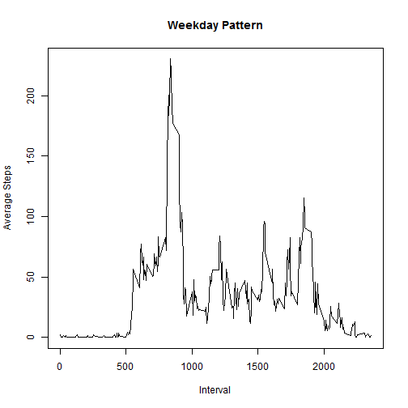
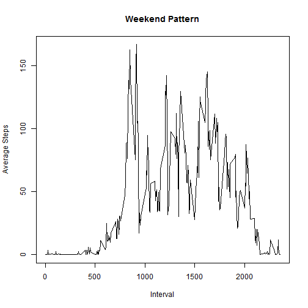

## Loading and preprocessing the data

```r
##UnZip the File
unzip("activity.zip")

##Read the CSV File
activity_data<-read.csv("activity.csv")

#Convert the Factor variable to date
activity_data$date<-as.Date(activity_data$date)
```


## What is mean total number of steps taken per day?

```r
#Load the sqldf library
library(sqldf)
```

```
## Loading required package: gsubfn
## Loading required package: proto
## Loading required package: RSQLite
## Loading required package: DBI
## Loading required package: RSQLite.extfuns
```

```r
#Ignore NA - Get the total steps per day
total_steps_per_day<-sqldf("select sum(steps) as total_steps,date from activity_data where steps!='NA'  group by date")
```

```
## Loading required package: tcltk
```

```r
barplot(total_steps_per_day$total_steps,names.arg=format(total_steps_per_day$date,format='%d/%m'),xlab="Dates",main="Total Steps / Day",ylab="Total Steps")
```

 

```r
mean_per_day<-round(mean(total_steps_per_day$total_steps),0)
print(paste('Mean per day:' , mean_per_day,sep=""))
```

```
## [1] "Mean per day:10766"
```

```r
median_per_day<-round(median(total_steps_per_day$total_steps),0)
print(paste('Median per day:' , median_per_day,sep=""))
```

```
## [1] "Median per day:10765"
```


## What is the average daily activity pattern?

```r
avg_daily_steps<-sqldf("select avg(steps) as avg_steps,interval from activity_data where steps!='NA' group by interval")

plot(avg_daily_steps$interval,avg_daily_steps$avg_steps,type="l",ylab="Average Steps",xlab="Interval", main="Average Daily Pattern")
```

 

```r
max_interval<-head(avg_daily_steps[order(-avg_daily_steps$avg_steps),],1)
```

```
## [1] "5-min interval which contains the maximum steps averages across all the days:835"
```

## Imputing missing values

```r
total_obs<-dim(activity_data)[1]
total_complete_cases<-sqldf("select count(*) as TOTAL_NA from activity_data where steps!='NA' ")
total_nas<-total_obs-total_complete_cases

print(paste('Total number of observations with NA:',total_nas,sep=""))
```

```
## [1] "Total number of observations with NA:2304"
```

```r
#Remove NA's with the mean for that 5-minute interval,  
activity_data_without_na<-activity_data
for (i in 1:total_obs)
{
  if(is.na(activity_data_without_na[i,1]))
  {
    current_interval<-activity_data_without_na[i,3]
    ##print(round(avg_daily_steps[avg_daily_steps$interval==current_interval,1],0))
    activity_data_without_na[i,1]<-round(avg_daily_steps[avg_daily_steps$interval==current_interval,1],0)
  }
}

#Histogram for the Total number of steps taken eac day

total_steps_per_day2<-sqldf("select sum(steps) as total_steps,date from activity_data_without_na group by date")
barplot(total_steps_per_day2$total_steps,names.arg=format(total_steps_per_day2$date,format='%d/%m'),xlab="Dates",main="Total Steps / Day",ylab="Total Steps")
```

 

```r
mean_per_day2<-round(mean(total_steps_per_day2$total_steps),0)
print(paste('Mean per day:' , mean_per_day2,sep=""))
```

```
## [1] "Mean per day:10766"
```

```r
median_per_day2<-round(median(total_steps_per_day2$total_steps),0)
print(paste('Median per day:' , median_per_day2,sep=""))
```

```
## [1] "Median per day:10762"
```

```r
print("The median has changed, whereas the mean is still the same.")
```

```
## [1] "The median has changed, whereas the mean is still the same."
```

## Are there differences in activity patterns between weekdays and weekends?

```r
#Add another column DayTYpe
activity_data_without_na$DayType<-c("")

#Update DayType to weekday or Weekend
for (i in 1:total_obs)
{
  if((weekdays(activity_data_without_na[i,2])=="Sunday") || (weekdays(activity_data_without_na[i,2])=="Saturday"))
  {
    activity_data_without_na[i,4]<-'Weekend'
  }
  else
  {
   activity_data_without_na[i,4]<-'Weekday'
  }
}


weekday_avg<-sqldf("select avg(steps) as avg_steps,interval from activity_data_without_na where DayType='Weekday' 
                   group by interval")
                   
weekend_avg<-sqldf("select avg(steps) as avg_steps,interval from activity_data_without_na where DayType='Weekend'
                   group by interval")


plot(weekday_avg$interval,weekday_avg$avg_steps,type="l",ylab="Average Steps",xlab="Interval",main="Weekday Pattern")
```

 

```r
plot(weekend_avg$interval,weekend_avg$avg_steps,type="l",ylab="Average Steps",xlab="Interval",main="Weekend Pattern")
```

 
